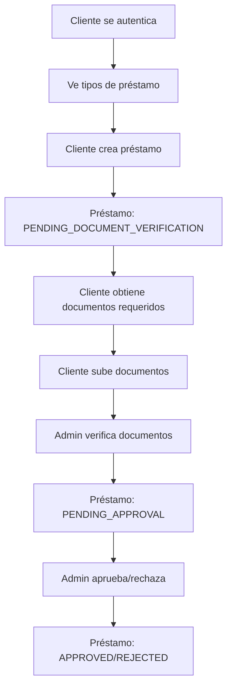

# 🏦 Flujo de Solicitud de Crédito de Libranza

## 📋 **Resumen del Proceso**

Un cliente solicita un crédito de libranza siguiendo estos pasos:

1. **Autenticación** → Cliente se loguea
2. **Selección de Tipo** → Elige "Libranza" 
3. **Creación de Préstamo** → Crea préstamo en estado `PENDING_DOCUMENT_VERIFICATION`
4. **Subida de Documentos** → Cliente sube archivos requeridos para el préstamo específico
5. **Verificación** → Admin/Advisor verifica documentos
6. **Aprobación** → Admin aprueba/rechaza solicitud
7. **Desembolso** → Si es aprobado, se procesa el desembolso

---

## 🔄 **Flujo Visual**



---

## 🎯 **Estados del Préstamo**

### **Estados Principales:**
- `PENDING_DOCUMENT_VERIFICATION` → Cliente debe subir documentos
- `PENDING_VERIFICATION` → Documentos subidos, esperando verificación
- `PENDING_APPROVAL` → Documentos verificados, esperando aprobación
- `APPROVED` → Aprobado, listo para desembolso
- `REJECTED` → Rechazado
- `DISBURSED` → Desembolsado
- `ACTIVE` → En curso de pago
- `COMPLETED` → Pagado completamente
- `CANCELLED` → Cancelado

### **Estados de Documento:**
- `PENDING` → Recién subido, esperando verificación
- `VERIFIED` → Verificado y aprobado
- `REJECTED` → Rechazado, necesita corrección
- `EXPIRED` → Expirado, necesita renovación

---

## 🔄 **Flujo Detallado con Endpoints**

### **Paso 1: Autenticación**
```http
POST /auth/login
Content-Type: application/json

{
  "email": "cliente@ejemplo.com",
  "password": "password123"
}
```

**Respuesta:**
```json
{
  "access_token": "jwt_token_here",
  "user": {
    "id": "client-uuid",
    "role": "CLIENT",
    "email": "cliente@ejemplo.com"
  }
}
```

### **Paso 2: Obtener Tipos de Préstamo Disponibles**
```http
GET /loan-types?isActive=true
Authorization: Bearer jwt_token_here
```

**Respuesta:**
```json
{
  "data": [
    {
      "id": "libranza-uuid",
      "name": "Crédito por Libranza",
      "description": "Préstamo descontado de nómina",
      "maxAmount": 50000000,
      "interestRate": 0.015,
      "isActive": true
    }
  ],
  "total": 1
}
```

### **Paso 3: Crear Solicitud de Préstamo**
```http
POST /loans
Authorization: Bearer jwt_token_here
Content-Type: application/json

{
  "loanTypeId": "libranza-uuid",
  "amount": 25000000,
  "termMonths": 24,
  "purpose": "Gastos personales"
}
```

**Respuesta:**
```json
{
  "loanId": "loan-uuid",
  "status": "PENDING_DOCUMENT_VERIFICATION",
  "amount": 25000000,
  "termMonths": 24,
  "monthlyPayment": 1250000,
  "totalInterest": 5000000,
  "createdAt": "2024-01-15T10:45:00Z",
  "message": "Préstamo creado. Debe subir los documentos requeridos para continuar."
}
```

### **Paso 4: Obtener Documentos Requeridos para el Cliente y Tipo de Préstamo**
```http
GET /document-types/required/{loanTypeId}/{clientId}
Authorization: Bearer jwt_token_here
```

**Ejemplo para Policía Activo:**
```http
GET /document-types/required/libranza-uuid/cliente-policia-activo-uuid
```

**Respuesta:**
```json
[
  {
    "documentTypeId": "cedula-uuid",
    "documentCode": "CEDULA",
    "documentName": "Cédula de Ciudadanía",
    "isMandatory": true,
    "displayOrder": 1,
    "description": "Documento de identificación",
    "mimeTypes": ["application/pdf", "image/jpeg"],
    "maxFileSize": 10485760
  },
  {
    "documentTypeId": "comprobante-nomina-uuid",
    "documentCode": "COMPROBANTE_NOMINA",
    "documentName": "Comprobante de Nómina",
    "isMandatory": true,
    "displayOrder": 2,
    "description": "Últimos 3 comprobantes de nómina",
    "mimeTypes": ["application/pdf"],
    "maxFileSize": 10485760
  },
  {
    "documentTypeId": "certificado-laboral-uuid",
    "documentCode": "CERTIFICADO_LABORAL",
    "documentName": "Certificado Laboral",
    "isMandatory": true,
    "displayOrder": 3,
    "description": "Certificado de trabajo actual",
    "mimeTypes": ["application/pdf"],
    "maxFileSize": 10485760
  },
  {
    "documentTypeId": "autorizacion-descuento-uuid",
    "documentCode": "AUTORIZACION_DESCUENTO",
    "documentName": "Autorización de Descuento",
    "isMandatory": true,
    "displayOrder": 4,
    "description": "Autorización para descuento por nómina",
    "mimeTypes": ["application/pdf"],
    "maxFileSize": 10485760
  }
]
```

### **Paso 5: Validar Documentos Requeridos (Opcional)**
```http
GET /client-documents/validate-required/{loanTypeId}
Authorization: Bearer jwt_token_here
```

**Respuesta:**
```json
{
  "loanTypeId": "libranza-uuid",
  "clientId": "cliente-uuid",
  "hasAllRequiredDocuments": false,
  "missingDocuments": [
    {
      "documentTypeId": "cedula-uuid",
      "documentCode": "CEDULA",
      "documentName": "Cédula de Ciudadanía",
      "isMandatory": true
    },
    {
      "documentTypeId": "comprobante-nomina-uuid",
      "documentCode": "COMPROBANTE_NOMINA",
      "documentName": "Comprobante de Nómina",
      "isMandatory": true
    }
  ],
  "uploadedDocuments": []
}
```

### **Paso 6: Subir Documentos**
```http
POST /client-documents/upload
Authorization: Bearer jwt_token_here
Content-Type: multipart/form-data

{
  "file": [archivo_binario]
}
```

**Respuesta:**
```json
{
  "message": "Document upload endpoint - to be implemented",
  "file": "cedula_123456.pdf",
  "clientId": "cliente-uuid"
}
```

### **Paso 7: Listar Documentos del Cliente**
```http
GET /client-documents
Authorization: Bearer jwt_token_here
```

**Respuesta:**
```json
{
  "message": "Get client documents endpoint - to be implemented",
  "clientId": "cliente-uuid",
  "status": null
}
```

---

## 🔍 **Flujo de Verificación (Admin/Advisor)**

### **Paso 7: Verificar Documentos**
```http
PATCH /client-documents/{documentId}/verify
Authorization: Bearer admin_jwt_token
Content-Type: application/json

{
  "status": "VERIFIED",
  "verificationNotes": "Documento válido y legible",
  "verifiedBy": "admin-uuid"
}
```

### **Paso 8: Aprobar/Rechazar Préstamo**
```http
PATCH /loans/{loanId}/approve
Authorization: Bearer admin_jwt_token
Content-Type: application/json

{
  "status": "APPROVED",
  "approvedBy": "admin-uuid",
  "approvalNotes": "Documentos verificados, cliente cumple requisitos",
  "approvedAmount": 25000000,
  "approvedTermMonths": 24
}
```

---

## 🔐 **Validaciones por Estado**

### **PENDING_DOCUMENT_VERIFICATION:**
- ✅ Cliente puede subir documentos
- ✅ Cliente puede ver documentos requeridos
- ❌ Admin NO puede verificar documentos
- ❌ Admin NO puede aprobar préstamo

### **PENDING_VERIFICATION:**
- ✅ Admin puede verificar documentos
- ❌ Cliente NO puede subir más documentos
- ❌ Admin NO puede aprobar préstamo

### **PENDING_APPROVAL:**
- ✅ Admin puede aprobar/rechazar préstamo
- ❌ Cliente NO puede modificar documentos
- ❌ Admin NO puede verificar documentos

---

## 🎯 **Endpoints Principales por Módulo**

### **Users Module (Auth):**
- `POST /users/sign-up` - Registro público de clientes
- `POST /users/login` - Iniciar sesión
- `GET /users/me` - Obtener información del usuario actual
- `GET /users/me/profile` - Obtener perfil completo del cliente
- `GET /users/` - Listar usuarios (ADMIN/ADVISOR)
- `GET /users/clients` - Obtener clientes con información crediticia (ADMIN/ADVISOR)
- `GET /users/clients/{id}` - Obtener información de cliente por ID
- `POST /users/admin/users` - Crear cualquier tipo de usuario (ADMIN)
- `POST /users/advisor/clients` - Crear clientes (ADVISOR)

### **Clients Module:**
- `POST /clients` - Crear perfil crediticio para usuario existente (ADMIN/ADVISOR)
- `GET /clients` - Buscar clientes con filtros y paginación
- `GET /clients/{id}` - Obtener cliente por ID
- `PATCH /clients/{id}` - Actualizar información crediticia del cliente
- `DELETE /clients/{id}` - Eliminar perfil crediticio del cliente

### **Organizations Module:**
- `POST /organizations` - Crear nueva organización
- `GET /organizations` - Buscar organizaciones con filtros y paginación
- `GET /organizations/{id}` - Obtener organización por ID
- `PATCH /organizations/{id}` - Actualizar organización
- `DELETE /organizations/{id}` - Eliminar organización

### **Loan Types Module:**
- `GET /loan-types` - Listar tipos de préstamo (ADMIN)
- `GET /loan-types/{id}` - Obtener tipo específico (ADMIN)
- `POST /loan-types` - Crear tipo de préstamo (ADMIN)
- `PATCH /loan-types/{id}` - Actualizar tipo de préstamo (ADMIN)
- `DELETE /loan-types/{id}` - Eliminar tipo de préstamo (ADMIN)

### **Document Types Module:**
- `GET /document-types/required/{loanTypeId}/{clientId}` - Documentos requeridos para cliente y tipo de préstamo
- `GET /document-types` - Listar tipos de documento (ADMIN)
- `POST /document-types` - Crear tipo de documento (ADMIN)
- `GET /document-types/{id}` - Obtener tipo de documento por ID (ADMIN)
- `PATCH /document-types/{id}` - Actualizar tipo de documento (ADMIN)
- `DELETE /document-types/{id}` - Eliminar tipo de documento (ADMIN)
- `GET /document-types/requirements/{loanTypeId}` - Configuración de requisitos (ADMIN)
- `POST /document-types/requirements` - Agregar requisito (ADMIN)

### **Client Documents Module:**
- `GET /client-documents/validate-required/{loanTypeId}` - Validar documentos requeridos
- `POST /client-documents/upload` - Subir documento
- `GET /client-documents` - Listar documentos del cliente
- `GET /client-documents/{id}` - Obtener documento específico

### **Loans Module:**
- `POST /loans` - Crear solicitud de préstamo
- `GET /loans` - Listar préstamos con filtros y paginación
- `GET /loans/{id}` - Obtener préstamo específico
- `PATCH /loans/{id}` - Actualizar préstamo
- `DELETE /loans/{id}` - Eliminar préstamo (soft delete)

---

## 🔐 **Permisos por Rol**

### **CLIENT:**
- ✅ Registrarse (`POST /users/sign-up`)
- ✅ Iniciar sesión (`POST /users/login`)
- ✅ Ver su perfil (`GET /users/me`, `GET /users/me/profile`)
- ✅ Ver documentos requeridos (`GET /document-types/required/{loanTypeId}/{clientId}`)
- ✅ Validar documentos (`GET /client-documents/validate-required/{loanTypeId}`)
- ✅ Subir documentos (`POST /client-documents/upload`)
- ✅ Ver sus documentos (`GET /client-documents`)
- ✅ Crear solicitud de préstamo (`POST /loans`)
- ✅ Ver sus préstamos (`GET /loans`)

### **ADVISOR:**
- ✅ Todo lo del CLIENT
- ✅ Crear clientes (`POST /users/advisor/clients`, `POST /clients`)
- ✅ Ver todos los usuarios (`GET /users/`)
- ✅ Ver clientes con información crediticia (`GET /users/clients`)
- ✅ Ver información de cualquier cliente (`GET /users/clients/{id}`)
- ✅ Gestionar organizaciones (CRUD completo)
- ✅ Verificar documentos (cuando se implemente)

### **ADMIN:**
- ✅ Todo lo del ADVISOR
- ✅ Crear cualquier tipo de usuario (`POST /users/admin/users`)
- ✅ Gestionar tipos de préstamo (CRUD completo)
- ✅ Gestionar tipos de documento (CRUD completo)
- ✅ Configurar requisitos de documentos (`GET/POST /document-types/requirements`)
- ✅ Gestionar préstamos (CRUD completo)
- ✅ Gestionar clientes (CRUD completo)
- ✅ Gestionar organizaciones (CRUD completo)

---

## 📱 **Ejemplo de Flujo Completo en Frontend**

```typescript
// 1. Login
const authResponse = await fetch('/auth/login', {
  method: 'POST',
  body: JSON.stringify({ email, password })
});

// 2. Obtener tipos de préstamo
const loanTypes = await fetch('/loan-types?isActive=true', {
  headers: { Authorization: `Bearer ${token}` }
});

// 3. Crear solicitud de préstamo
const loanResponse = await fetch('/loans', {
  method: 'POST',
  headers: { 
    Authorization: `Bearer ${token}`,
    'Content-Type': 'application/json'
  },
  body: JSON.stringify({
    loanTypeId: 'libranza-uuid',
    amount: 25000000,
    termMonths: 24,
    purpose: 'Gastos personales'
  })
});

const loan = await loanResponse.json();
const loanId = loan.loanId;

// 4. Obtener documentos requeridos para el cliente y tipo de préstamo
const requiredDocs = await fetch(`/document-types/required/${loanTypeId}/${clientId}`, {
  headers: { Authorization: `Bearer ${token}` }
});

const requiredDocsData = await requiredDocs.json();
console.log(`Documentos requeridos: ${requiredDocsData.length}`);

// 5. Validar documentos requeridos (opcional)
const validation = await fetch(`/client-documents/validate-required/${loanTypeId}`, {
  headers: { Authorization: `Bearer ${token}` }
});

const validationData = await validation.json();
console.log(`Tiene todos los documentos: ${validationData.hasAllRequiredDocuments}`);

// 6. Subir documentos
for (const doc of requiredDocsData) {
  const formData = new FormData();
  formData.append('file', file);

  const uploadResponse = await fetch('/client-documents/upload', {
    method: 'POST',
    headers: { Authorization: `Bearer ${token}` },
    body: formData
  });
}

// 7. Listar documentos del cliente
const clientDocs = await fetch('/client-documents', {
  headers: { Authorization: `Bearer ${token}` }
});

const clientDocsData = await clientDocs.json();
console.log(`Documentos del cliente: ${clientDocsData.message}`);
```

---

## ⚠️ **Consideraciones Técnicas**

### **🔒 Seguridad**
- **Validación de Archivos**: Verificar tipo MIME, tamaño máximo, formato permitido
- **Sanitización**: Limpiar nombres de archivo y validar IPs de origen
- **Autenticación**: Todos los endpoints requieren token JWT válido
- **Autorización**: Control granular por roles (CLIENT, ADVISOR, ADMIN)

### **💾 Almacenamiento**
- **Servicio de Archivos**: Usar AWS S3 o similar para documentos
- **Backup**: Respaldo automático de documentos importantes
- **Retención**: Políticas de retención según normativas legales

### **📊 Auditoría**
- **Trazabilidad**: Registro de todas las acciones importantes
- **Estados**: Cambios de estado del préstamo y documentos
- **Usuarios**: Quién realizó cada acción y cuándo

### **🔔 Notificaciones**
- **Cambios de Estado**: Informar al cliente sobre progreso
- **Documentos**: Notificar cuando se requieren o verifican documentos
- **Aprobaciones**: Comunicar decisiones de aprobación/rechazo

---

## 🎯 **Características del Flujo**

✅ **Creación Inmediata**: El cliente puede crear el préstamo sin documentos previos  
✅ **Estados Claros**: Cada estado indica exactamente qué hacer  
✅ **Validación Progresiva**: Cada paso tiene sus propias reglas  
✅ **Experiencia Intuitiva**: Flujo natural y comprensible  
✅ **Flexibilidad**: Se adapta a diferentes organizaciones y tipos de préstamo  

Este flujo asegura un proceso **completo, seguro y escalable** para la solicitud de créditos de libranza.
