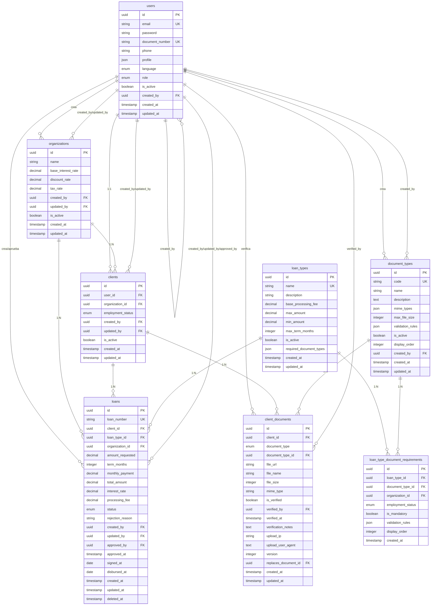
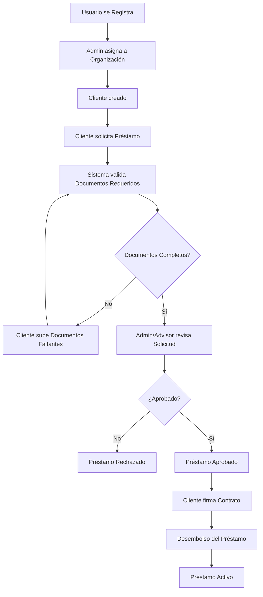
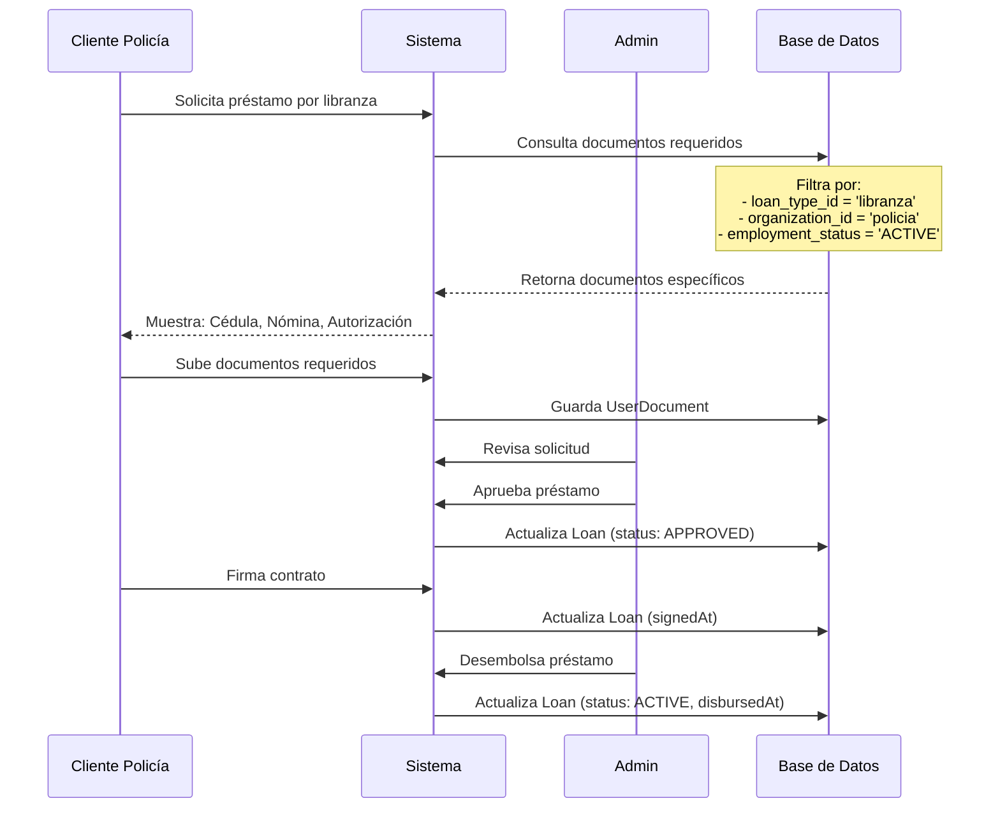
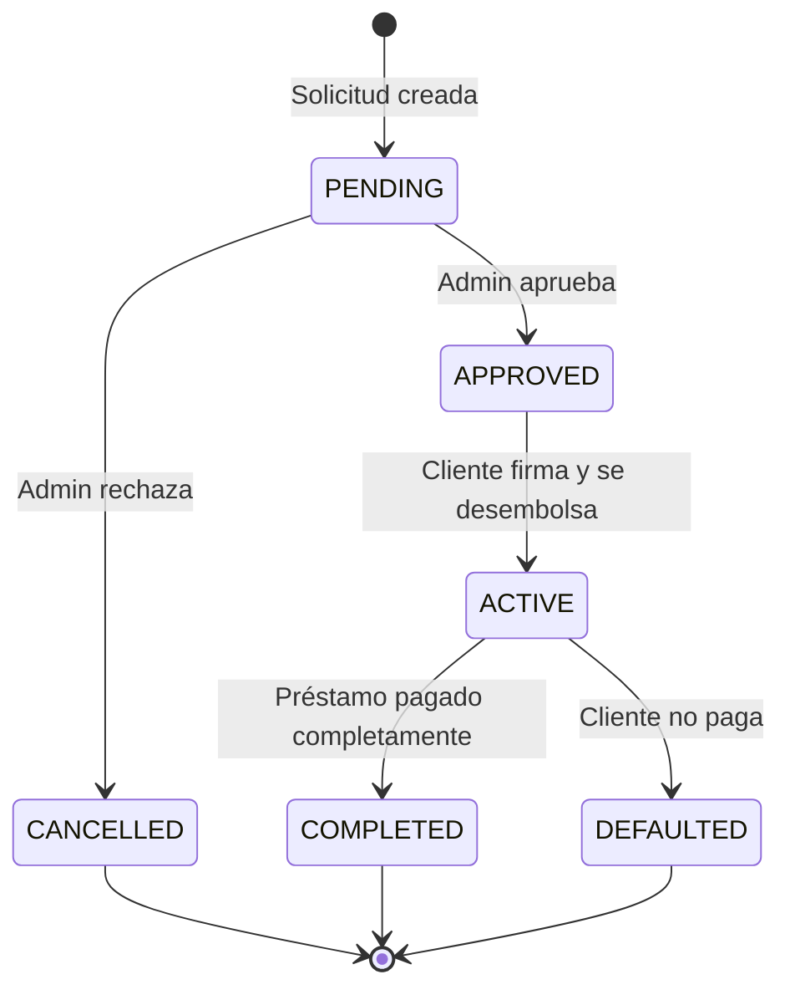
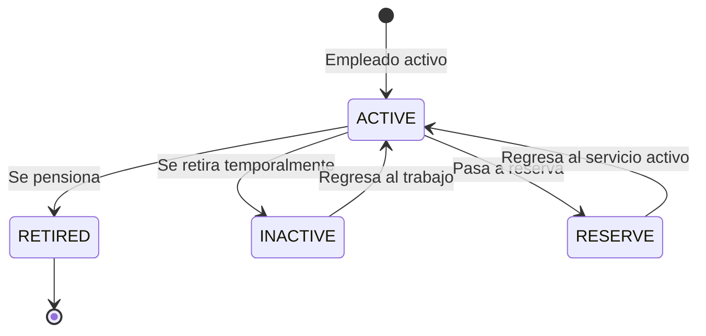
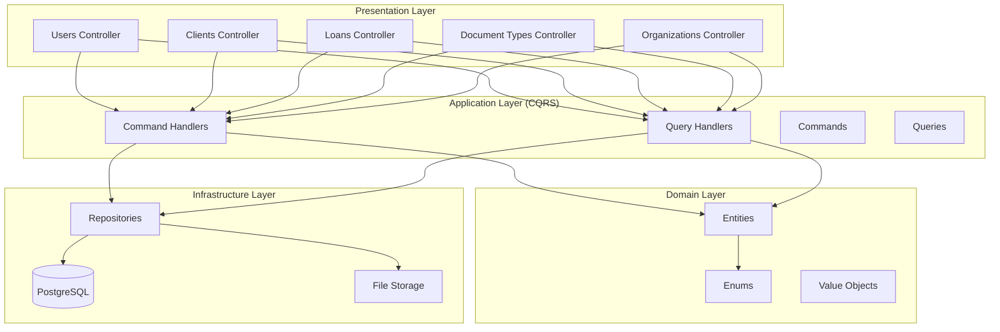

# 🏗️ Diagrama de Relaciones del Sistema de Créditos

## 📊 Diagrama ER (Entity Relationship)

## 🔄 Flujo de Datos Principal

## 🎯 Caso de Uso: Policía Activo

## 📋 Estados del Sistema

### Estados de Préstamo

### Estados de Empleo

## 🔐 Matriz de Permisos

| Rol | Crear Usuario | Crear Cliente | Crear Préstamo | Aprobar Préstamo | Gestionar Documentos |
|-----|---------------|---------------|----------------|------------------|---------------------|
| CLIENT | ❌ | ❌ | ✅ | ❌ | ✅ (subir) |
| ADVISOR | ❌ | ✅ | ✅ | ✅ | ✅ (verificar) |
| ADMIN | ✅ | ✅ | ✅ | ✅ | ✅ (todo) |

## 🎨 Arquitectura de Módulos

Esta documentación proporciona una visión completa del sistema, desde la estructura de datos hasta los flujos de negocio y la arquitectura técnica implementada.
